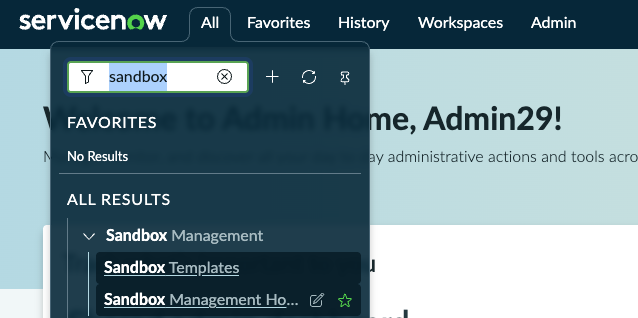
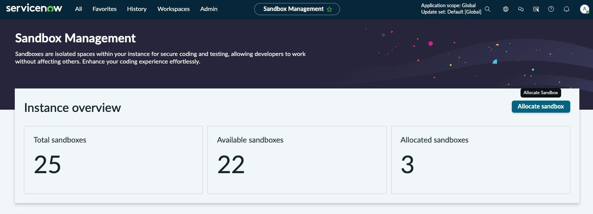
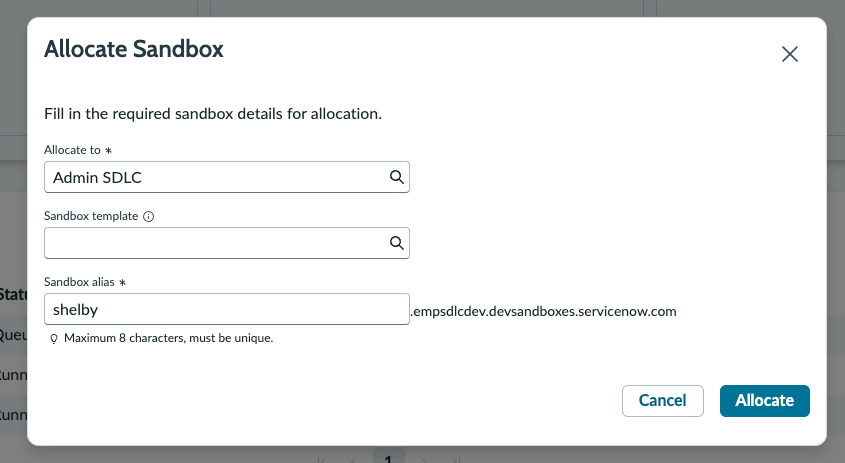

# Creating a Fluent application using nowSDK

[← Back to slide 8 in the deck](https://servicenow.github.io/servicenowsdlc/#8) | [日本語版](https://github.com/ServiceNow/servicenowsdlc/blob/main/exercises/01-creating-a-fluent-app.ja.md)

## Objective

Create a new Fluent application using nowSDK, and connect it to source control — the two pieces of tooling everything else today builds on.

## Estimated Time

20-25 minutes

## Prerequisites

- [ ] Signed up for your instance credentials and have a sandbox allocated (Setup Instructions steps 1-3 below cover this if you haven't yet)
- [ ] Check that you have Node version 20.18.0 or newer (`node -v`)
- [ ] If you don't have Node 20.18.0 or newer, run `nvm install 20.18.0`
- [ ] A GitHub account with access to the workshop org/repo (see the "Get your source control ready" slide)

## Setup Instructions

1. Sign up for your instance credentials on the [instance sign-up sheet](https://servicenow-my.sharepoint.com/:x:/p/shelby_cohen/IQDPcQEo1cNpT7XNsBeEi9J_AYPIviiz8XC2P7KjYkhbBhg).
2. Log in to the base instance at [https://empsdlcdev.service-now.com/](https://empsdlcdev.service-now.com/) with those credentials.
3. Allocate your own sandbox, named after you:
    - Go to [Sandbox Management Home](https://empsdlcdev.service-now.com/now/developer-sandbox/home) directly, or search `sandbox` in the top nav and open **Sandbox Management Home**.

      
    - Click **Allocate sandbox**.

      
    - In the **Allocate Sandbox** dialog, leave **Sandbox template** empty. Set **Sandbox alias** to the same `<your_name>` convention as the rest of this exercise (max 8 characters, must be unique), so it doesn't collide with anyone else's, then click **Allocate**.

      
    - Wait for it to finish provisioning — that sandbox's URL is the `<instance url>` used for the rest of this exercise.
4. Open a terminal window
    - Either use the terminal that is already open in your WindSurf/IDE or open a new terminal window
    - The exercise steps will be executed in the WindSurf terminal but can be adapted for any terminal.
5. Install the ServiceNow SDK: `npm i -g @servicenow/sdk`
6. Run `now-sdk --version` and verify the version installed is >= `4.6.0`
7. If you will be using VSCode, install the Fluent Language extension from [here](https://marketplace.visualstudio.com/items?itemName=ServiceNow.fluent-language-extension).
8. If you will be using Windsurf or another VSCode fork, install from [here](https://open-vsx.org/extension/ServiceNow/fluent-language-extension)
9. Set up an authentication profile for your sandbox using `now auth --add <instance url> --type basic`

> **Naming convention:** everywhere below you'll see `<your_name>` — replace it with your own first name, lowercase, no spaces (e.g. `shelby`). This is a shared instance; a unique app/scope name is what keeps your app from colliding with everyone else's.

## Exercise Steps

### Step 1: Initialize the Fluent Application

1. Create a new empty directory and call it `bootcamp-demo-<your_name>`
2. Move into the directory: `cd bootcamp-demo-<your_name>`
3. Create a new Fluent (ServiceNow SDK) application by running `now-sdk init`
4. Use your keyboard arrows to select `now-sdk + basic` under the `-- TypeScript --` section:
   ```txt
    ? Select a template:
     -- Basic --
      now-sdk boilerplate
     -- JavaScript --
      now-sdk + basic
      now-sdk + fullstack React
     -- TypeScript --
    ❯ now-sdk + basic
      now-sdk + fullstack React
      now-sdk + fullstack Vue
    A basic application using NowSDK and TypeScript
    ```
5. For `Name of ServiceNow Application:`, enter `My First Fluent App - <Your Name>` (e.g. `My First Fluent App - Shelby`)
6. For `NPM package name:`, enter `my-first-fluent-app-<your_name>`
7. For `Create a Global/Scoped App?`, select `Scoped`
8. For `Scope name:`, enter `sn_my_first_fluent_<your_name>`
9. Run `npm install` to install dependencies for the newly created Fluent app (Fluent apps are basically NPM packages, therefore tools around the Node/NPM ecosystem can be used)

At this point, SDK has scaffolded out a sample Fluent project using TypeScript as the language for the project's [Javascript server-side modules](https://www.servicenow.com/docs/r/washingtondc/application-development/scripts/c_JS_modes.html). By default, Javascript server-side modules are defined inside `src/server`.

Your project structure should look something like this:
```txt
├── now.config.json <-- this is where the scope name, scope ID, and scope's sys_id (GUID) is defined. This is the file that makes the NPM package a ServiceNow SDK (Fluent) project
├── package-lock.json <-- this is a standard NPM package-lock.json file
├── package.json <-- this is a standard NPM package.json where attributes about the package are defined and dependencies are listed
└── src <---default source code directory
    ├── fluent <-- sub-directory for Fluent files
    │   └── example.now.ts <-- sample Fluent file, note the `.now.ts` extension
    ├── server <-- Server-side modules directory
    │   ├── script.ts <-- sample TS server module
    │   └── tsconfig.json <-- tsconfig.json for the server modules
    ├── tsconfig.client.json <-- tsconfig.json for client code. Your project does not have src/client at this point.
    ├── tsconfig.json <-- base tsconfig.json
    └── tsconfig.server.json <-- tsconfig.json for server-side code that is _not_ server modules (i.e.: Business Rule scripts, Script include scripts, etc...)
```
10. Delete the `example.now.ts` file from fluent directory.

### Step 2: Set up git

Git — not the Update Set — is the authoritative source of truth for this app going forward (see the "Git is the authoritative source of truth" slide). Connect this project to it now, before you write any metadata:

1. Initialize a repo in your project root:
   ```
   git init
   git add .
   git commit -m "Initial commit: bootcamp-demo-<your_name> scaffold"
   ```
2. Create a new **empty** repo under the workshop's GitHub org (no README/license — you already have files locally), then point your local repo at it and push:
   ```
   git remote add origin <your new repo's URL>
   git branch -M main
   git push -u origin main
   ```
3. Connect your ServiceNow dev instance's source control setup to this same repo, using the personal access token you generated on the "Get your source control ready" slide. The exact click path is covered in depth in [Exercise 05 — Source control](https://github.com/ServiceNow/servicenowsdlc/blob/main/exercises/05-source-control.md); for now, confirm the connection succeeds before moving on.

### Step 3: Build and Install the application

1. `now-sdk build` - Builds the application
2. `now-sdk install` - Deploys the application to ServiceNow.
3. Hint: You can add a custom command to your `package.json` to make this easier.
`"build-deploy": "now-sdk build && now-sdk install"` and then run `npm run build-deploy`.
4. Commit and push what you just built:
   ```
   git add .
   git commit -m "Initial build"
   git push
   ```

### Step 4: Verify in ServiceNow

1. Navigate to the ServiceNow instance and verify the app installed successfully (App Manager or Studio should show it, at your scope, with the version you built).

## Success Criteria

- [ ] Fluent application initialized with a unique, name-appended app/scope (no collision with other attendees)
- [ ] Local repo initialized, pushed to the workshop GitHub org, and connected to your dev instance's source control setup
- [ ] Have built and installed the application to ServiceNow

## Learning Points

- The SDK scaffolds a real Fluent project from a CLI wizard — typed, diagnosable source you build and install yourself, not a black box of clicks you can't inspect or diff.
- Git, not the app itself, is what makes this reproducible past this one exercise — connecting it now means every later exercise (build, off-instance dev, source control, ReleaseOps) has something real to build on.
- A unique app/scope name isn't cosmetic on a shared instance — it's the difference between "my app" and "whoever pushed last."

## Bonus Challenge

- Add a table and a business rule of your own (a Fluent `Table()` and `BusinessRule()`, same patterns as today's build exercise), then build and install again
- Open a pull request against your own repo with a small change, just to see the review flow before Exercise 05 does it for real
