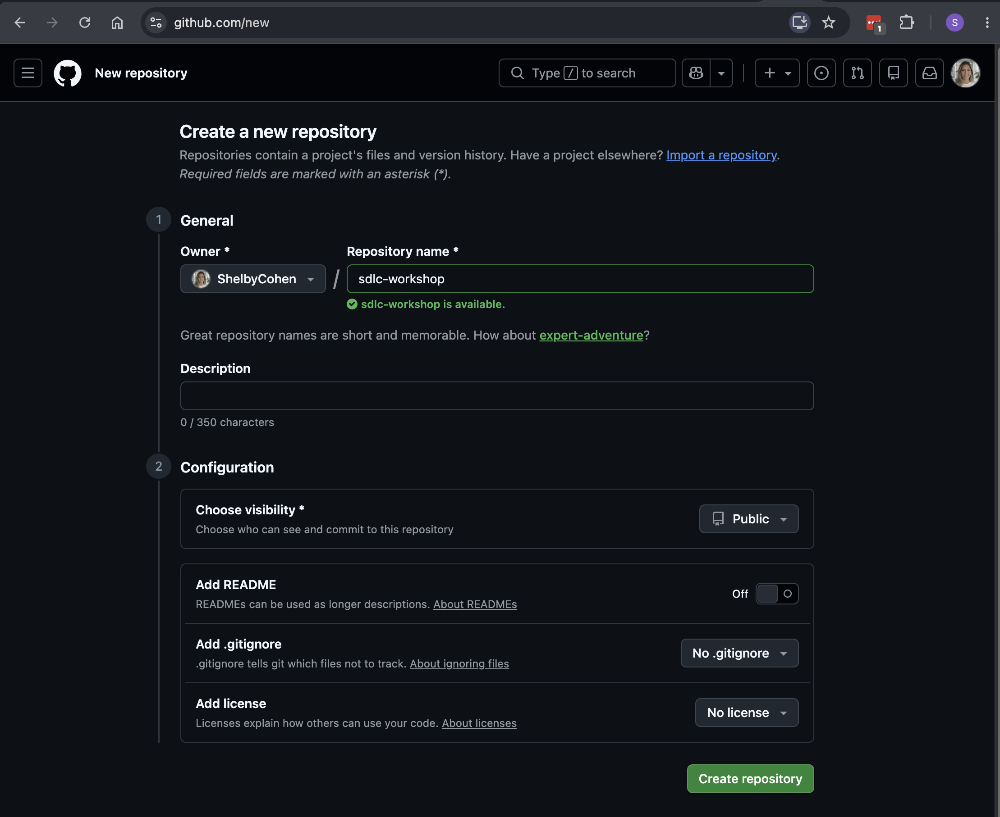
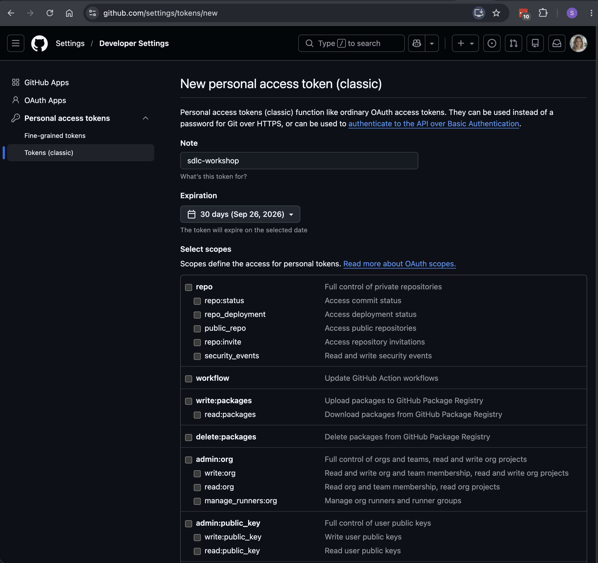
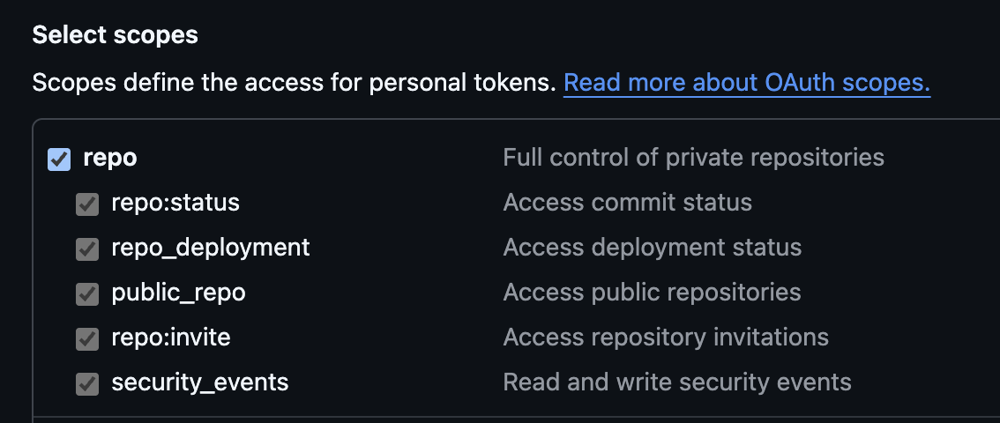
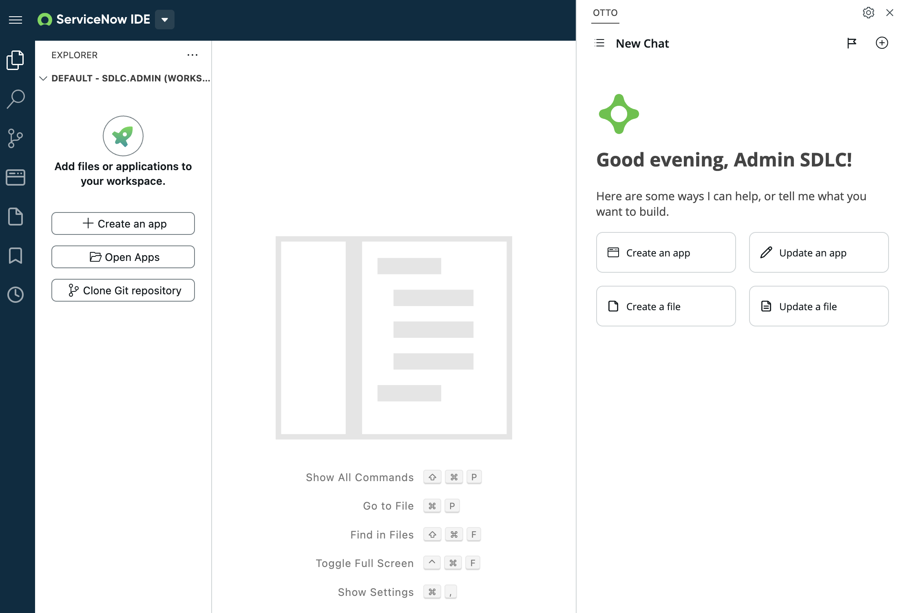
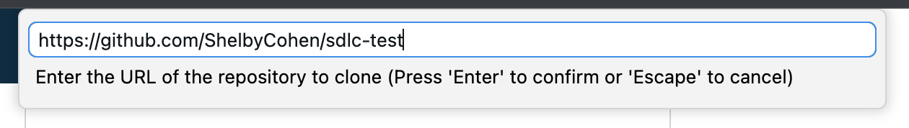

# Creating a Fluent application and setting up source control

[← Back to slide 10 in the deck](https://servicenow.github.io/servicenowsdlc/#10) | [日本語版](https://github.com/ServiceNow/servicenowsdlc/blob/main/exercises/01-creating-a-fluent-app.ja.md)

## Objective

Create a new Fluent application using nowSDK, and connect it to source control — the two pieces of tooling everything else today builds on. This is the same app you'll keep building on all day — Build Agent extends it in Exercise 03, and it's what gets pushed, released, and deployed in the exercises after that. By the end of this exercise, everyone should have their own sandbox created and be logged in to their instance — that's the baseline the rest of the day assumes.

## Estimated Time

20-25 minutes

## Prerequisites

- [ ] Signed up for your instance credentials and have a sandbox allocated (Setup Instructions steps 1-3 below cover this if you haven't yet)
- [ ] Check that you have Node version 20.18.0 or newer (`node -v`)
- [ ] If you don't have Node 20.18.0 or newer, run `nvm install 20.18.0`
- [ ] A personal GitHub.com account

## Setup Instructions

1. Sign up for your instance credentials on the [instance sign-up sheet](https://servicenow-my.sharepoint.com/:x:/p/shelby_cohen/IQDPcQEo1cNpT7XNsBeEi9J_AYPIviiz8XC2P7KjYkhbBhg).
2. Log in to the base instance with those credentials — use the URL listed in the **Instance Link** column for your row on the sign-up sheet (it'll be `empsdlcdev`, `empsdlcdev1`, or `empsdlcdev2`).
3. Allocate your own sandbox, named after you:
    - On your base instance, go to `<instance url>/now/developer-sandbox/home` directly, or search `sandbox` in the top nav and open **Sandbox Management Home**.

      
    - Click **Allocate sandbox**.

      
    - In the **Allocate Sandbox** dialog, leave **Sandbox template** empty. Set **Sandbox alias** to the same `<your_name>` convention as the rest of this exercise (max 8 characters, must be unique), so it doesn't collide with anyone else's, then click **Allocate**.

      
    - Wait for it to finish provisioning — that sandbox's URL is the `<instance url>` used for the rest of this exercise.

> **Naming convention:** everywhere below you'll see `<your_name>`, replace it with your own first name, lowercase, no spaces (e.g. `shelby`). This is a shared instance; a unique app/scope name is what keeps your app from colliding with everyone else's. If your first name collides with another attendee's, or is long enough to push a scope name over the 18-character limit (see Step 1 below), use your ServiceNow userid instead.

## Exercise Steps

### Step 1: Initialize the Fluent Application

1. Open a terminal window
    - Either use the terminal that is already open in your WindSurf/IDE or open a new terminal window
    - The exercise steps will be executed in the WindSurf terminal but can be adapted for any terminal.
2. Install the ServiceNow SDK: `npm i -g @servicenow/sdk`
3. Run `now-sdk --version` and verify the version installed is >= `4.6.0`
4. If you will be using VSCode, install the Fluent Language extension from [here](https://marketplace.visualstudio.com/items?itemName=ServiceNow.fluent-language-extension).
5. If you will be using Windsurf or another VSCode fork, install from [here](https://open-vsx.org/extension/ServiceNow/fluent-language-extension)
6. Set up an authentication profile for your sandbox: `now-sdk auth --add <instance url> --type basic`
    - `<instance url>` is the sandbox URL from Step 3 above (e.g. `https://<sandboxalias>.<base-instance>.service-now.com`) — not the base instance URL.
    - Use the same username/password you used to log in to the instance.
    - Confirm the command reports a successful authentication before moving on — if it fails, double-check you're pointing at the sandbox URL, not the base instance.
7. Create a new empty directory and call it `sdlc-workshop-<your_name>`
8. Move into the directory: `cd sdlc-workshop-<your_name>`
9. Create a new Fluent (ServiceNow SDK) application by running `now-sdk init`
10. Use your keyboard arrows to select `now-sdk + basic` under the `-- TypeScript --` section:
   ```txt
    ? Select a template:
     -- Basic --
      now-sdk boilerplate
     -- JavaScript --
      now-sdk + basic
      now-sdk + fullstack React
     -- TypeScript --
    ❯ now-sdk + basic
      now-sdk + fullstack React
      now-sdk + fullstack Vue
    A basic application using NowSDK and TypeScript
   ```
11. For `Name of ServiceNow Application:`, you must type this yourself — there's no default. Enter `Maintenance_<YourName>` (e.g. `Maintenance_Shelby`). This is the same app name Build Agent will extend in Exercise 03, so keep it exactly as you type it here.
12. For `NPM package name:`, accept the suggested default (derived from the app name).
13. For `Create a Global/Scoped App?`, select `Scoped`
14. For `Scope name:`, accept the suggested default. If you're prompted to type one yourself, use `x_snc_<your_name>` — ServiceNow scope names have an 18-character limit, so keep `<your_name>` short.
15. Run `npm install` to install dependencies for the newly created Fluent app (Fluent apps are basically NPM packages, therefore tools around the Node/NPM ecosystem can be used)

At this point, SDK has scaffolded out a sample Fluent project using TypeScript as the language for the project's [Javascript server-side modules](https://www.servicenow.com/docs/r/washingtondc/application-development/scripts/c_JS_modes.html). By default, Javascript server-side modules are defined inside `src/server`.

Your project structure should look something like this:
```txt
├── now.config.json <-- this is where the scope name, scope ID, and scope's sys_id (GUID) is defined. This is the file that makes the NPM package a ServiceNow SDK (Fluent) project
├── package-lock.json <-- this is a standard NPM package-lock.json file
├── package.json <-- this is a standard NPM package.json where attributes about the package are defined and dependencies are listed
└── src <---default source code directory
    ├── fluent <-- sub-directory for Fluent files
    ├── server <-- Server-side modules directory
    │   ├── script.ts <-- sample TS server module
    │   └── tsconfig.json <-- tsconfig.json for the server modules
    ├── tsconfig.client.json <-- tsconfig.json for client code. Your project does not have src/client at this point.
    ├── tsconfig.json <-- base tsconfig.json
    └── tsconfig.server.json <-- tsconfig.json for server-side code that is _not_ server modules (i.e.: Business Rule scripts, Script include scripts, etc...)
```

### Step 2: Set up git

Git — not the Update Set — is the authoritative source of truth for this app going forward (see the "Git is the authoritative source of truth" slide). Connect this project to it now, before you write any metadata:

1. Set your local git identity to your personal GitHub.com account (skip if it's already your machine's global default):
   ```
   git config user.name "<your GitHub username>"
   git config user.email "<your GitHub-registered email>"
   ```
2. Initialize a repo in your project root:
   ```
   git init
   git add .
   git commit -m "Initial commit: sdlc-workshop-<your_name> scaffold"
   ```
3. Create a new empty repository (no README, no `.gitignore`, no license — you already have files locally):
    - Navigate to [github.com/new](https://github.com/new).
    - Set an owner and repository name, leave visibility, README, `.gitignore`, and license as shown below, then click **Create repository**.

      
    - Point your local repo at the new (empty) repo and push:
      ```
      git remote add origin <your new repo's URL>
      git branch -M main
      git push -u origin main
      ```
4. Generate a personal access token — this is what lets ServiceNow authenticate to your repo:
    - Navigate to [github.com/settings/tokens](https://github.com/settings/tokens) (Settings → Developer settings → Personal access tokens → Tokens (classic)).
    - Click **Generate new token** → **Generate new token (classic)**.
    - Give it a name, and under **Select scopes**, check the top-level **repo** box — that automatically checks every sub-scope underneath it.

      

      
    - Scroll down and click **Generate token**.

      
    - **Copy the token now.** You'll need it in the next step, and GitHub will not show it to you again once you leave this page — if you lose it, you'll have to generate a new one.
5. Connect your sandbox to this repo:
    - Open the ServiceNow IDE on your sandbox instance (the `<instance url>` from Setup Instructions step 3). If nothing is open yet, the Explorer panel offers **Clone Git repository** alongside **Create an app** and **Open Apps** — click it.

      
    - Enter the URL of the repository you created in step 3, then press Enter.

      
    - A message pops up in the bottom-right corner asking you to configure git credentials. Click **Configure**, then enter your GitHub username and paste the personal access token from step 4 as the password.
    - Confirm the clone completes successfully. If it fails with an authentication error, regenerate the token and make sure the `repo` scope is checked.
6. Sync the instance-side connection: in Studio, run **Sync** (not `now-sdk install` — Sync pulls from the instance into your local source, the opposite direction). This is also what to use later if you ever make a change directly in the instance UI instead of through the IDE.
    - Sync depends on the same credentials you configured in step 5 — if it fails with a fetch/download error, that's usually the token or scope permissions, not a git problem.

### Step 3: Build and Install the application

1. `now-sdk build` - Builds the application
2. `now-sdk install` - Deploys the application to ServiceNow.
3. Hint: You can add a custom command to your `package.json` to make this easier.
`"build-deploy": "now-sdk build && now-sdk install"` and then run `npm run build-deploy`.
4. Commit and push what you just built:
   ```
   git add .
   git commit -m "Initial build"
   git push
   ```

### Step 4: Verify in ServiceNow

1. Navigate to the ServiceNow instance and verify the app installed successfully (App Manager or Studio should show it, at your scope, with the version you built).

## Success Criteria

- [ ] Fluent application initialized with a unique, name-appended app/scope (no collision with other attendees)
- [ ] Local repo initialized, pushed to a new empty GitHub repository, and cloned into your dev instance's IDE
- [ ] Have built and installed the application to ServiceNow

## Learning Points

- The SDK scaffolds a real Fluent project from a CLI wizard — typed, diagnosable source you build and install yourself, not a black box of clicks you can't inspect or diff.
- Git, not the app itself, is what makes this reproducible past this one exercise — connecting it now means every later exercise (build, off-instance dev, source control, ReleaseOps) has something real to build on.
- A unique app/scope name isn't cosmetic on a shared instance — it's the difference between "my app" and "whoever pushed last."

## Bonus Challenge

- Add a table and a business rule of your own (a Fluent `Table()` and `BusinessRule()`, same patterns as today's build exercise), then build and install again
- Open a pull request against your own repo with a small change, just to see the review flow before Exercise 05 does it for real
