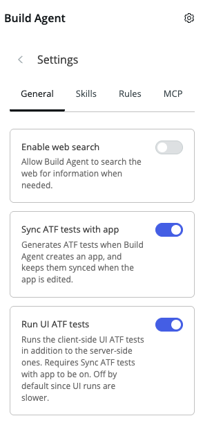

# Build + test the maintenance app

[← Back to slide 18 in the deck](https://servicenow.github.io/servicenowsdlc/#18) | [日本語版](https://github.com/ServiceNow/servicenowsdlc/blob/main/exercises/03-build-maintenance-app.ja.md)

## Objective

Use Build Agent (and ATF) to go from a natural-language prompt to a working maintenance-request app, extending the `Maintenance_<YourName>` app you scaffolded in Exercise 01, using the build-ready requirements your team wrote earlier.

## Estimated Time

60 minutes

## Prerequisites

- Sandbox allocated, with the `Maintenance_<YourName>` app from Exercise 01 built and installed
- Feature branch created:
  1. From your project root (the same one from Exercise 01, connected to your sandbox), make sure you're up to date: `git pull origin main`
  2. Create and switch to a feature branch: `git checkout -b feature/maintenance-app`
- Build-ready requirements from the previous activity (entities, roles/access, Given-When-Then)
- "Sync ATF tests with app" turned on in Build Agent settings (General tab) — this is what generates ATF tests as you build and keeps them synced as the app changes



## Exercise Steps

1. Open Build Agent in the IDE, inside your `Maintenance_<YourName>` project from Exercise 01 — we're covering off-instance later.
2. Prompt Build Agent with your build-ready requirements — name the entities, roles/access, and the Given-When-Then scenario directly in the prompt. You're extending the app you already created, not starting a new one, so the app name in the prompt should match `Maintenance_<YourName>` exactly as you named it in Exercise 01. If your team used the reference scenario from the requirements activity, paste this as-is; otherwise swap in your own entities/roles/Given-When-Then:
   ```
   Build a Maintenance Request app named "Maintenance_<YourName>" with:

   Entities: Maintenance Request, Equipment

   Roles:
   - Requester: create and view their own Maintenance Requests
   - Technician: view assigned Maintenance Requests, update their status

   Given a Requester submits a Maintenance Request for active Equipment,
   when they submit it,
   then a Maintenance Request record is created in "New" state and
   assigned according to a routing rule.
   ```
3. Review what Build Agent creates. If you're curious what's happening under the hood, ask it to show you the Fluent (`.now.ts`) code — this is optional and aimed at architects:
   ```
   Show me the Fluent (.now.ts) code you just generated for this app.
   ```
   Look at the Fluent code for the Maintenance Request table — it should look something like this:
   ```typescript
   export const MaintenanceRequest = Table({
     label: 'Maintenance Request',
     fields: { equipment: Reference('equipment') }
   });
   ```
4. When asked if you want ATF tests written for your change, select "Yes, proceed" — your changes will get test coverage added.
5. Install the app to your sandbox:
   ```
   now-sdk install --sandbox
   ```
6. Manually walk through the golden path in your sandbox and confirm it matches your Given-When-Then scenario.

## Success Criteria

- [ ] The entities from your requirements exist as tables in your sandbox
- [ ] Roles/access match what your team specified
- [ ] The golden path works end-to-end and matches your Given-When-Then scenario
- [ ] At least one ATF test passes

## Learning Points

- The SDK and Fluent turn a natural-language prompt into typed, diagnosable source — not a black box of clicks you can't inspect or diff.
- Writing an ATF test in the same session you build the feature keeps tests in the dev loop instead of a follow-up task nobody gets back to.
- Test Agent covers ~13 step types out of the box (form, server, REST, etc.). If an edge case needs a step type it doesn't support, author that step manually in the Standard UI test editor (All > Automated Testing Framework > Tests) instead.

## Bonus Challenge

- Add Technician assignment/routing logic:
  ```
  Add routing logic so new Maintenance Requests are automatically
  assigned to the Technician with the fewest open assignments.
  ```
- Add more ATF tests to cover edge cases or rejection paths:
  ```
  Generate an ATF test for the case where a Technician tries to update
  a Maintenance Request that isn't assigned to them. Confirm the update
  is rejected.
  ```
- Add role-based access restrictions and verify them as a non-privileged user:
  ```
  Add access control so only the assigned Technician (or an admin) can
  update a Maintenance Request's status, and Requesters can only view
  their own requests.
  ```
